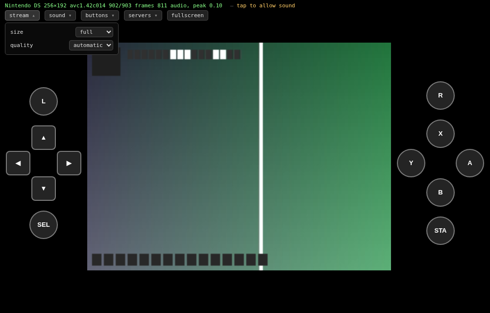
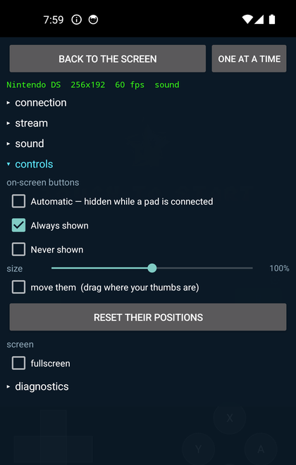
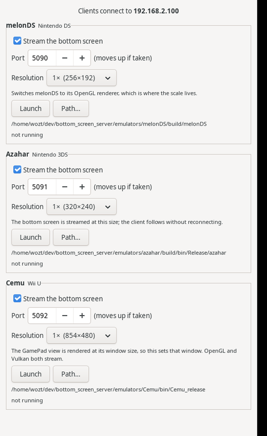

# Bottom Screen

Stream a Nintendo console's bottom screen out of an emulator and onto a
phone, a browser, or a Switch — with touch and buttons travelling back
the other way.


Three consoles, three emulators, one protocol: **melonDS** for the DS,
**Azahar** for the 3DS, **Cemu** for the Wii U. A client is not
configured for a console — the server announces which one it is serving,
how big the screen is and which buttons exist, and the interface builds
itself from that. Plug a client into a different emulator and it becomes
a different console.

No emulator, BIOS, firmware, key or game is distributed here. Bring your
own; this adds a bridge to one you already have.

---

## What it does

- **The bottom screen, live** — read inside the emulator before it is
  composited, so nothing depends on a window being visible.
- **Touch and buttons back** — a tap on your phone is a stylus on the
  console. Your own pad on the host keeps working alongside it.
- **Sound**, taken before the emulator's own volume: muting the PC does
  not silence the phone.
- **Any renderer** — software, OpenGL, OpenGL compute, Vulkan. It does
  not matter which one the emulator was started with.
- **Internal resolution followed live.** Turn the emulator up to 4× and
  the stream grows with it, without dropping the clients watching.
- **Four clients at once**, off one encoder. A second viewer costs
  bandwidth, not a core.

---

## The clients

### In a browser

Open the port the emulator is listening on. Nothing to install.

```
http://192.168.1.20:5090/
```



The same H.264 the phone gets, decoded by **WebCodecs** — in hardware
where the machine has it, and with no transcoding anywhere. A browser
without WebCodecs is told so rather than left with a blank canvas.

The **servers** menu remembers the other emulators, since each serves
its own page on its own port, and following one of its links carries the
list along.

### On Android




<br clear="both">

Hardware decoding through MediaCodec, straight into a Surface. Movable
on-screen buttons, sticks where the console has them, sound with volume
and mute, and a list of saved servers so an address is never typed
twice. A physical pad works too — its presses are merged with the
on-screen ones rather than replacing them.

```sh
cd android && ./gradlew assembleDebug
adb install -r app/build/outputs/apk/debug/app-debug.apk
```

### On a Switch — not finished

Built with devkitA64 and libnx. The console's own video block decodes the
stream, its touchscreen is the stylus, and the Joy-Cons are the buttons.

**This one is not done yet.** It builds, shows its menu, connects and
receives a stream — and then draws nothing once the picture starts. It
needs testing on real hardware, which is where it is going next; see
[switch/README.md](switch/README.md).

### On Linux

Handy for checking a pipeline without a phone.

```sh
./bottom_screen_client --host 192.168.1.20 --port 5090
```

---

## The launcher



Three things have to be right before each launch — the stream, the port,
the internal resolution — and each emulator keeps them somewhere
different, two of them with a trap in it.

So the launcher does that, and nothing else: loading a game or mapping a
pad is still the emulator's job.

It shows the port **actually bound**, which is not always the one asked
for: a server whose port is taken moves to the next, which is what lets
the three run together. Files it edits are backed up beside themselves.

```sh
make launcher/bs_launcher && ./launcher/bs_launcher
```

`--set-resolution <emulator> <n>` does the same with no window.

<br clear="both">

---

## Getting it running

### 1. Build this

```sh
sudo apt install libavcodec-dev libavutil-dev libswscale-dev \
                 libswresample-dev libsdl2-dev libgtk-3-dev
make
```

### 2. Put the bridge in an emulator

Two ways, and the difference matters.

**Clone the fork.** The same change with a repository around it, already
applied and known to build:

| Console | Fork, on the `bottom-screen` branch |
|---|---|
| Nintendo DS | [wozt/melonDS](https://github.com/wozt/melonDS/tree/bottom-screen) |
| Nintendo 3DS | [wozt/azahar](https://github.com/wozt/azahar/tree/bottom-screen) |
| Wii U | [wozt/Cemu](https://github.com/wozt/Cemu/tree/bottom-screen) |

The bridge is on `bottom-screen`, never on the default branch, so the
branch has to be asked for:

```sh
git clone -b bottom-screen --recursive https://github.com/wozt/melonDS
```

**Or apply the patch** to a checkout of your own:

```sh
git -C melonDS apply patches/melonDS.patch
```

> **The patch will not last.** Each one names, in its header, the exact
> upstream commit it was made against — and it hooks into specific
> places in specific files. When an emulator moves on, a hunk that no
> longer matches is refused, and `git apply` says so. That is the good
> case. The worse one is a hunk that still applies to code which has
> changed meaning around it.
>
> So the patches are a snapshot, not a supported upgrade path. If an
> emulator has moved and the patch will not go on, take the fork
> instead, or rebase its `bottom-screen` branch onto the new upstream —
> a branch is the thing that survives an upstream that keeps moving,
> which is exactly why both exist.
>
> The patches here are regenerated from the forks, never edited, and a
> test fails if they fall behind. That keeps them honest about the forks
> — it says nothing about upstream.

### 3. Put them side by side

```
bottom_screen_server/
├── bs_server.c, bs_encoder.c, …      the core, in C
└── emulators/
    ├── melonDS/
    ├── azahar/
    └── Cemu/
```

The emulator's build looks for this directory beside it and turns the
bridge on by itself. Without it, the fork builds exactly like upstream.

### 4. Start an emulator and open the port

That is all. The emulator announces where it is listening.

---

## What works, and what does not

Everything above is verified against real games rather than a test
pattern: a commercial DS title, a commercial 3DS title, a commercial Wii U title.

Still open:

- **The Switch homebrew**, which is unfinished: it connects but does not
  yet draw the picture.
- **The 3DS system menu** — Azahar crashes when the Artic Setup Tool
  connects, so the system files are not installed. Games and homebrew
  run.
- **Input merging with a physical pad**, which is written into all three
  bridges but has never been tried with a hand actually on one.

[ROADMAP.md](ROADMAP.md) has the detail, including the mistakes worth
remembering.

---

## The protocol

One header, [bs_protocol.h](bs_protocol.h), included by both ends. TCP,
port 5090 by default, H.264 for the picture and Opus for the sound. The
browser gets the same bytes inside WebSocket frames, on the same port —
a native client opens with `BSC1` and a browser with `GET `, and they
cannot be confused.

One thing that costs dearly when forgotten: touch coordinates are in
**the space the server announced**, not the console's native size.
Dividing by the latter puts every tap wrong by exactly the resolution
scale, and it looks like a calibration problem when it is arithmetic.

---

## Licences

melonDS is GPL-3.0, Azahar GPL-2.0, Cemu MPL-2.0. The patches and forks
are published under those terms. Everything in this repository that is
not one of those is my own.
