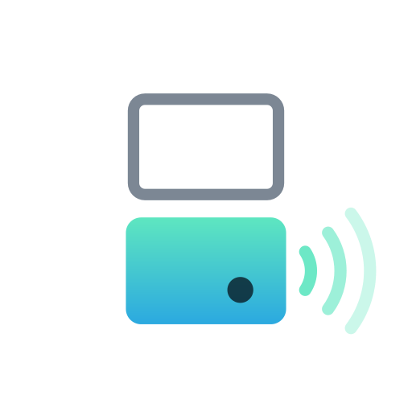
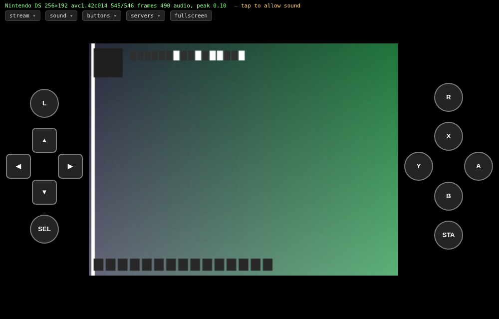
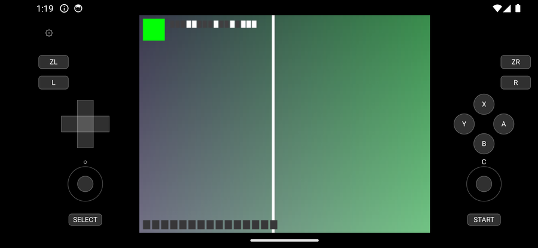

# Bottom Screen

Stream a Nintendo console's bottom screen out of an emulator and onto a
phone, a browser, or a Switch — with touch and buttons travelling back
the other way.

<br clear="left">

Three consoles, three emulators, one protocol: **melonDS** for the DS,
**Azahar** for the 3DS, **Cemu** for the Wii U. A client is not
configured for a console — the server announces which one it is serving,
how big the screen is and which buttons exist, and the interface builds
itself from that. Plug a client into a different emulator and it becomes
a different console.

No emulator, BIOS, firmware, key or game is distributed here. Bring your
own; this adds a bridge to one you already have.

---

## What it does

- **The bottom screen, live** — read inside the emulator before it is
  composited, so nothing depends on a window being visible.
- **Touch and buttons back** — a tap on your phone is a stylus on the
  console. Your own pad on the host keeps working alongside it.
- **Sound**, taken where the emulator makes it rather than where it
  plays it: muting the PC does not silence the phone, and a PC with no
  output device configured still streams.
- **Any renderer** — software, OpenGL, OpenGL compute, Vulkan.
- **Internal resolution followed live**, up to 1440 tall. Turn the
  emulator up and the stream grows with it, without dropping the
  clients watching.
- **Four clients at once**, off one encoder. A second viewer costs
  bandwidth, not a core.

---

## The three clients

The same options in all three: size as a multiple of the console's own
screen, bitrate, volume, on-screen buttons that can be moved and saved
per console, and — on a Wii U — which of its two audio outputs to hear.

**Nintendo DS on the web client.** Nothing to install: open the port the
emulator is listening on.



**Nintendo 3DS on Android.** Hardware decoding through MediaCodec,
straight into a Surface.



**Wii U on the Switch.** Built with devkitA64 and libnx; the console's
own video block decodes the stream, its touchscreen is the stylus, and
the Joy-Cons are the buttons. Verified on real hardware. No screenshot:
taking one on a console means a capture card, and the picture would tell
you nothing the two above have not.

<details>
<summary>The rest of the interface</summary>

<br>

Menus follow [capture2cloud](https://github.com/wozt)'s design, so the
three are learned once. The on-screen pad on the Switch is ported from
its homebrew rather than written again — a round d-pad zone that gives
diagonals, each control its own shape, and a finger bound to whatever it
lands on until it lifts.


A pad plugged into the host keeps working while somebody plays from a
client: the presses are merged rather than swapped. A client's buttons
reach the game whether or not the host has a controller configured.

There is a Linux client too, handy for checking a pipeline without a
phone:

```sh
./bottom_screen_client --host 192.168.1.20 --port 5090
```

</details>

<details>
<summary>The launcher</summary>

<br>


Three things have to be right before each launch — the stream, the port,
the internal resolution — and each emulator keeps them somewhere
different, two of them with a trap in it. So the launcher does that, and
nothing else: loading a game or mapping a pad is still the emulator's
job.

It shows the port **actually bound**, which is not always the one asked
for: a server whose port is taken moves to the next, which is what lets
the three run together. Files it edits are backed up beside themselves.

```sh
make launcher/bs_launcher && ./launcher/bs_launcher
```

`--set-resolution <emulator> <n>` does the same with no window.

<br clear="right">

</details>

---

## Getting it running

```sh
sudo apt install libavcodec-dev libavutil-dev libswscale-dev \
                 libswresample-dev libsdl2-dev libgtk-3-dev
make
```

Then put the bridge in an emulator — **clone the fork**, which is the
same change with a repository around it, already applied and known to
build:

| Console | Fork, on the `bottom-screen` branch |
|---|---|
| Nintendo DS | [wozt/melonDS](https://github.com/wozt/melonDS/tree/bottom-screen) |
| Nintendo 3DS | [wozt/azahar](https://github.com/wozt/azahar/tree/bottom-screen) |
| Wii U | [wozt/Cemu](https://github.com/wozt/Cemu/tree/bottom-screen) |

The bridge is never on the default branch, so the branch has to be asked
for:

```sh
git clone -b bottom-screen --recursive https://github.com/wozt/melonDS
```

Put it beside this directory — `emulators/melonDS`, `emulators/azahar`,
`emulators/Cemu` — and the emulator's build finds it and turns the
bridge on by itself. Without it, the fork builds exactly like upstream.
Then start an emulator: it announces where it is listening.

<details>
<summary>Or apply the patch, and why it will not last</summary>

<br>

```sh
git -C melonDS apply patches/melonDS.patch
```

Each patch names, in its header, the exact upstream commit it was made
against, and it hooks into specific places in specific files. When an
emulator moves on, a hunk that no longer matches is refused and `git
apply` says so. That is the good case. The worse one is a hunk that
still applies to code which has changed meaning around it.

So the patches are a snapshot, not a supported upgrade path. If an
emulator has moved and the patch will not go on, take the fork instead,
or rebase its `bottom-screen` branch onto the new upstream — a branch is
what survives an upstream that keeps moving, which is why both exist.

The patches here are regenerated from the forks, never edited, and a
test fails if they fall behind. That keeps them honest about the forks;
it says nothing about upstream.

</details>

---

## What is not finished

Verified against real games rather than a test pattern — one commercial
title per console. The screenshots use the built-in pattern; the testing
did not.

Still open:

- **A black picture on Android when connecting**, about one start in
  eight on a real phone. Two causes were found and fixed and at least
  one remains.
- **A requested bitrate is exceeded by about half again**, because the
  encoder is told a frame rate measured once at startup and never
  revisited.
- **The 3DS system titles**, which are not installed: the only route
  Azahar supports needs a second console.

[ROADMAP.md](ROADMAP.md) has the detail, including the mistakes worth
remembering.

<details>
<summary>The protocol</summary>

<br>

One header, [bs_protocol.h](bs_protocol.h), included by both ends. TCP,
port 5090 by default, H.264 for the picture and Opus for the sound. The
browser gets the same bytes inside WebSocket frames, on the same port —
a native client opens with `BSC1` and a browser with `GET `, and they
cannot be confused.

Two things that cost dearly when forgotten. Touch coordinates are in
**the space the server announced**, not the console's native size:
dividing by the latter puts every tap wrong by exactly the resolution
scale, and it looks like a calibration problem when it is arithmetic.
And no client may ask for a keyframe — there is one encoder behind all
of them, so a client that is struggling would bill its repairs to
everyone else.

</details>

<details>
<summary>Licences</summary>

<br>

melonDS is GPL-3.0, Azahar GPL-2.0, Cemu MPL-2.0. The patches and forks
are published under those terms. Everything in this repository that is
not one of those is my own.

</details>
