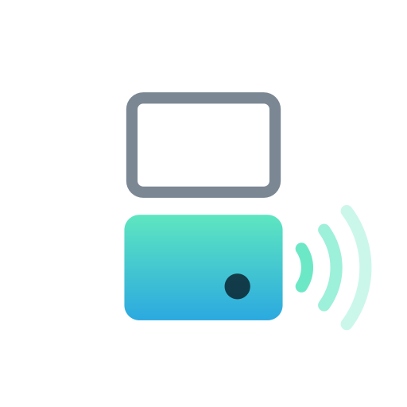
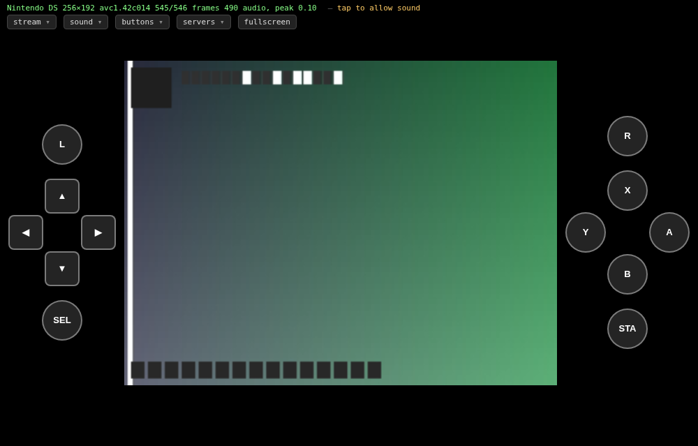
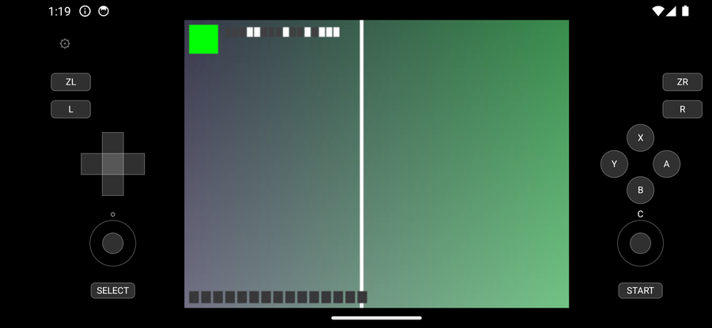
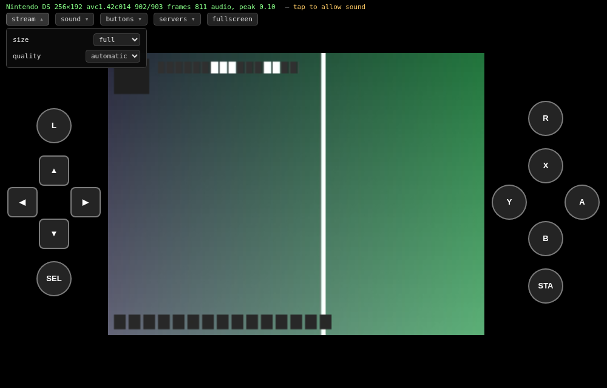
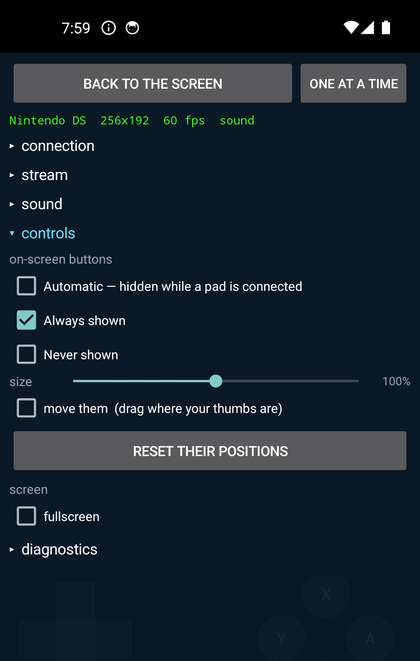
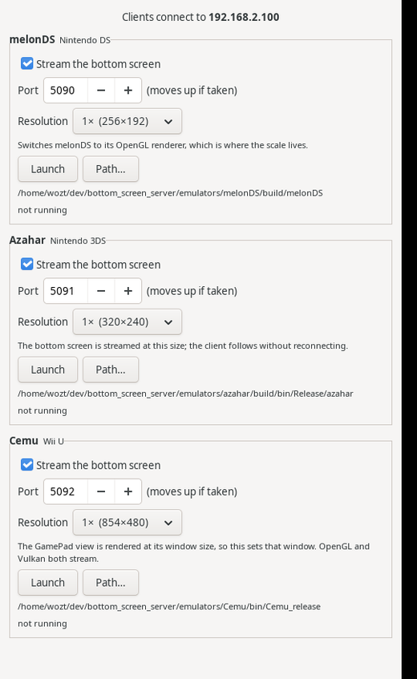

# Bottom Screen

Stream a Nintendo console's screen out of an emulator and onto a phone,
a browser, or a Switch — with touch and buttons travelling back the
other way.

<br clear="left">

Three consoles, three emulators, one protocol: **melonDS** for the DS,
**Azahar** for the 3DS, **Cemu** for the Wii U. A client is not
configured for a console — the server announces which one it is serving,
how big the screen is and which buttons exist, and the interface builds
itself from that. Plug a client into a different emulator and it becomes
a different console.

No emulator, BIOS, firmware, key or game is distributed here. Bring your
own; this adds a bridge to one you already have.

---

## What it does

- **The bottom screen, live** — read inside the emulator before it is
  composited, so nothing depends on a window being visible.
- **Or the top one**, chosen per client. Two people can watch two
  different screens at once, each at its own size and bitrate. A screen
  nobody has switched on costs the emulator nothing: it is not read back
  at all.
- **Touch and buttons back** — a tap on your phone is a stylus on the
  console. Your own pad on the host keeps working alongside it.
- **Sound**, taken where the emulator makes it rather than where it
  plays it: muting the PC does not silence the phone, and a PC with no
  output device configured still streams.
- **Any renderer** — software, OpenGL, OpenGL compute, Vulkan.
- **Hardware encoding by default**, falling back to the CPU when there
  is none. The available encoders are tried and the first one that
  actually opens wins. The selected encoder is announced at startup,
  and `--encoder libx264` forces software encoding.
- **Internal resolution followed live**, up to 1440 tall. Turn the
  emulator up and the stream grows with it without dropping connected
  clients.
- **Four clients at once**, off one encoder per screen. A second viewer
  costs bandwidth, not another encoder.
- **Emulator dialogs on the remote client.** A 3DS or Wii U can stop and
  ask for a name, message or other text. Instead of requiring access to
  the host desktop, supported prompts can be answered from the phone,
  browser or console client.

---

## Clients

The same core options are available across clients: which screen to
watch, resolution scale, bitrate, volume and movable on-screen controls
saved per console.

### Web

Nothing to install: open the port the emulator is listening on.



### Android

Hardware H.264 decoding through MediaCodec, rendered directly into a
Surface.



### Nintendo Switch

Built with devkitA64 and libnx. The Switch hardware decoder handles the
stream, the touchscreen acts as the stylus and the Joy-Cons provide
controller input.

Verified on real hardware.

### Linux

A native Linux client is included for testing or desktop use:

```sh
./bottom_screen_client --host 192.168.1.20 --port 5090
```

### Wii U GamePad

A real Wii U GamePad can also be used as a remote display and controller.
The launcher handles pairing, access-point setup and reconnection.

---

## Interface

Menus follow the same general design as
[capture2cloud](https://github.com/wozt/capture2cloud).




A controller connected directly to the host keeps working while somebody
plays from a remote client: inputs are merged rather than swapped.

The virtual pad adapts to the console and available screen space. Controls
can be moved and saved per console, while the layout prevents them from
overlapping the streamed picture.

---

## Launcher



The GTK launcher keeps the three emulators in one place and also manages
the physical Wii U GamePad connection.

It can:

- launch melonDS, Azahar and Cemu
- launch available system firmware / menus
- pair or reconnect a Wii U GamePad
- start and stop the GamePad access point
- display stream and encoder statistics
- show the port actually bound by each server

**Sync GamePad** performs a fresh Wii U GamePad pairing.
**Launch AP / Reconnect** reconnects an already paired GamePad.
**Stop AP** shuts the network down and returns its Wi-Fi interface to the
system.

AP control normally needs root privileges. Install the restricted Polkit
helper once:

```sh
sudo ./gamepad/tools/install-polkit.sh
```

After restarting the launcher, the GamePad networking controls work
without repeatedly asking for an administrator password.

The helper only exposes the required fixed networking operations.

<br clear="right">

---

## Getting it running

On Debian / Ubuntu:

```sh
sudo apt install libavcodec-dev libavutil-dev libswscale-dev \
                 libswresample-dev libsdl2-dev libgtk-3-dev

make
```

Then use one of the emulator forks containing the Bottom Screen bridge:

| Console | Fork, on the `bottom-screen` branch |
|---|---|
| Nintendo DS | [wozt/melonDS](https://github.com/wozt/melonDS/tree/bottom-screen) |
| Nintendo 3DS | [wozt/azahar](https://github.com/wozt/azahar/tree/bottom-screen) |
| Wii U | [wozt/Cemu](https://github.com/wozt/Cemu/tree/bottom-screen) |

For example:

```sh
git clone -b bottom-screen --recursive https://github.com/wozt/melonDS
```

Place the repositories next to this project:

```text
emulators/
├── melonDS/
├── azahar/
└── Cemu/
```

The emulator build detects the Bottom Screen bridge when available.

Loading games, firmware configuration and controller mapping remain the
emulator's responsibility.

---

## Launcher commands

```sh
scripts/bottom-screen              # GTK launcher
scripts/bottom-screen pad --stats  # emulator screen on a real GamePad
scripts/bottom-screen server       # standalone server with test pattern
scripts/bottom-screen test         # run the test suite
```

Build and run the launcher directly with:

```sh
make launcher/bs_launcher
./launcher/bs_launcher
```

---

## Protocol

The shared protocol is defined in [bs_protocol.h](bs_protocol.h).

By default:

- TCP port `5090`
- H.264 video
- Opus audio
- native clients and browsers share the same server
- browser traffic uses WebSocket framing

A native client starts with `BSC1`; a browser starts with `GET `, allowing
the server to distinguish them on the same port.

Touch coordinates use the resolution announced by the server rather than
the console's native resolution.

Clients do not request keyframes themselves because one encoder can be
shared by several viewers. The server handles keyframes when required,
including when a client joins an active stream or switches screens.

---

## Current limitations

The project has been tested against real games on all three supported
console families.

Known limitations:

- **Cemu does not currently provide the GamePad image when that view is
  not being rendered by its window.**
- **Requested bitrate can exceed the configured target** because the
  encoder frame-rate estimate is established at startup.
- Some **3DS system-title testing** depends on system software being
  installed in Azahar.

See [PROGRESS.md](PROGRESS.md) for development notes and detailed testing.

---

## License

Bottom Screen is licensed under the **GNU General Public License v3.0**.

See [LICENSE](LICENSE) for the full license text.

The supported emulator projects retain their own licenses:

- melonDS — GPL-3.0
- Azahar — GPL-2.0
- Cemu — MPL-2.0

Code and patches derived from those projects remain subject to their
respective upstream licenses.